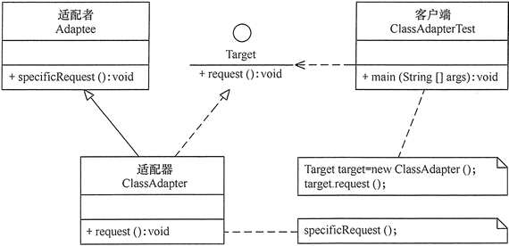
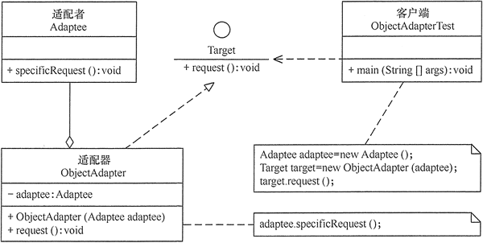

# Adapter

## 定义

将一个类的接口，转为为客户期望的另一个接口。适配器让原本接口不兼容的类可以合作无间。

## 优点

1. 客户端通过适配器可以透明地调用目标接口。
2. 复用了现存的类，程序员不需要修改原有代码而重用现有的适配者类。
3. 将目标类和适配者类解耦，解决了目标类和适配者类接口不一致的问题。
4. 在很多业务场景中符合开闭原则。

## 不足

1. 适配器编写过程需要结合业务场景全面考虑，可能会增加系统的复杂性。
2. 增加代码阅读难度，降低代码可读性，过多使用适配器会使系统代码变得凌乱。

## 结构

1. 类适配器(适合多继承)   

2. 对象适配器  
