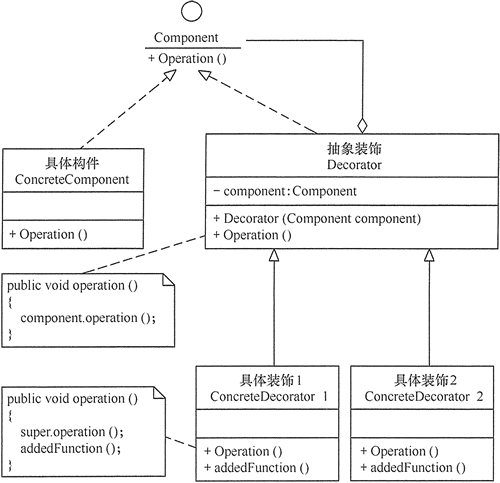

# decorator

## 定义

动态的将责任附加到对象上。若要扩展功能，装饰者提供了比继承共有弹性的替代方案。

## 优点

1. 装饰器是继承的有力补充，比继承灵活，在不改变原有对象的情况下，动态的给一个对象扩展功能，即插即用
2. 通过使用不用装饰类及这些装饰类的排列组合，可以实现不同效果
3. 装饰器模式完全遵守开闭原则

## 不足

1. 装饰器模式会增加许多子类，过度使用会增加程序得复杂性。

## 结构

