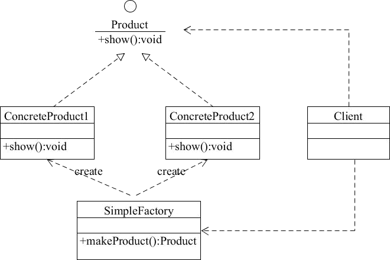
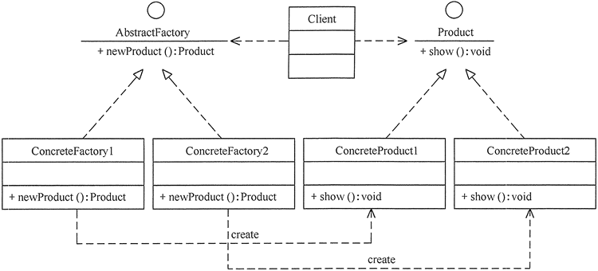

# Factory

## 定义

工厂方法模式: 定义了一个创建对象的接口，但由子类决定要实例化的类是哪一个。工厂方法让类把实例化推迟到子类。  
抽象工厂模式: 提供一个接口，用户创建相关或依赖对象的家族，而不需要明确指定具体类。  
简单工厂不是一种设计模式。

## 简单工厂

### 优点

1. 工厂类包含必要的逻辑判断，可以决定在什么时候创建哪一个产品的实例。客户端可以免除直接创建产品对象的职责，很方便的创建出相应的产品。工厂和产品的职责区分明确。
2. 客户端无需知道所创建具体产品的类名，只需知道参数即可。
3. 也可以引入配置文件，在不修改客户端代码的情况下更换和添加新的具体产品类。

### 不足

1. 简单工厂模式的工厂类单一，负责所有产品的创建，职责过重，一旦异常，整个系统将受影响。且工厂类代码会非常臃肿，违背高聚合原则。
2. 使用简单工厂模式会增加系统中类的个数（引入新的工厂类），增加系统的复杂度和理解难度
3. 系统扩展困难，一旦增加新产品不得不修改工厂逻辑，在产品类型较多时，可能造成逻辑过于复杂
4. 简单工厂模式使用了 static 工厂方法，造成工厂角色无法形成基于继承的等级结构。

### 结构

## 抽象工厂模式

### 优点

1. 可以在类的内部对产品族中相关联的多等级产品共同管理，而不必专门引入多个新的类来进行管理。
2. 当需要产品族时，抽象工厂可以保证客户端始终只使用同一个产品的产品组。
3. 抽象工厂增强了程序的可扩展性，当增加一个新的产品族时，不需要修改原代码，满足开闭原则。

### 不足

1. 当产品族中需要增加一个新的产品时，所有的工厂类都需要进行修改。增加了系统的抽象性和理解难度。

### 结构

## 工厂方法模式

### 优点

1. 用户只需要知道具体工厂的名称就可得到所要的产品，无须知道产品的具体创建过程。
2. 灵活性增强，对于新产品的创建，只需多写一个相应的工厂类。
3. 典型的解耦框架。高层模块只需要知道产品的抽象类，无须关心其他实现类，满足迪米特法则、依赖倒置原则和里氏替换原则。

## 不足

1. 类的个数容易过多，增加复杂度
2. 增加了系统的抽象性和理解难度
3. 抽象产品只能生产一种产品，此弊端可使用抽象工厂模式解决。

## 结构

