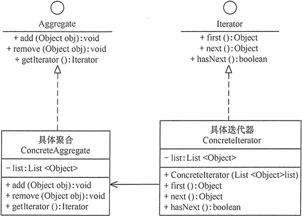

# iterator

## 定义

提供一种方法顺序访问一个聚合对象中的的各个元素，而又不暴露其内部的表示。

## 优点

1. 访问一个聚合对象的内容而无须暴露它的内部表示。
2. 遍历任务交由迭代器完成，这简化了聚合类。
3. 它支持以不同方式遍历一个聚合，甚至可以自定义迭代器的子类以支持新的遍历。
4. 增加新的聚合类和迭代器类都很方便，无须修改原有代码。
5. 封装性良好，为遍历不同的聚合结构提供一个统一的接口。

## 不足

1. 增加了类的个数，这在一定程度上增加了系统的复杂性。

## 结构

