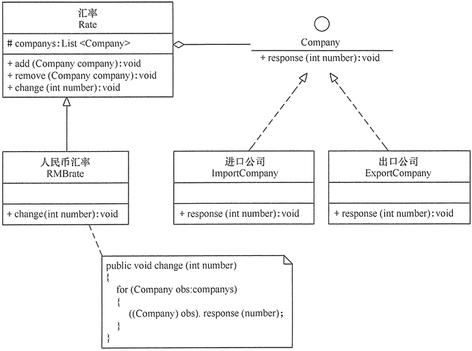

# Observer

## 定义

在对象之间定义一对多的依赖，这样一来，当一个对象改变状态， 依赖它的对象都会收到通知，并自动更新。

## 优点

1. 降低了目标与观察者之间的耦合关系，两者之间是抽象耦合关系。符合依赖倒置原则。
2. 目标与观察者之间建立了一套触发机制。

## 缺点

1. 目标与观察者之间的依赖关系并没有完全解除，而且有可能出现循环引用。
2. 当观察者对象很多时，通知的发布会花费很多时间，影响程序的效率。

## 类图

