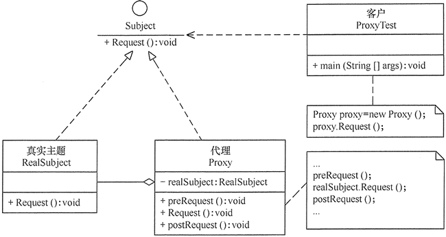

# proxy

## 定义

为另一个对象提供一个替身或占位符以访问这个对象。

## 优点

1. 代理模式在客户端与目标对象之间起到一个中介作用和保护目标对象的作用；
2. 代理对象可以扩展目标对象的功能；
3. 代理模式能将客户端与目标对象分离，在一定程度上降低了系统的耦合度，增加了程序的可扩展性

## 不足

1. 代理模式会造成系统设计中类的数量增加
2. 在客户端和目标对象之间增加一个代理对象，会造成请求处理速度变慢；
3. 增加了系统的复杂度；

## 结构

