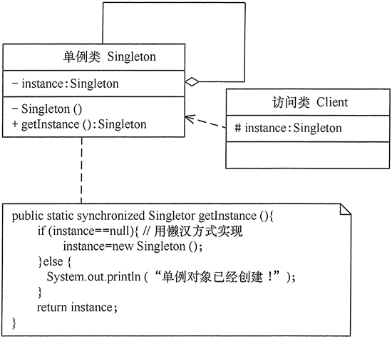

# Singleton

## 定义

确保一个类只有一个实例，并提供一个全局访问点

## 优点

1. 单例模式可以保证内存里只有一个实例，减少了内存的开销。
2. 可以避免对资源的多重占用。
3. 单例模式设置全局访问点，可以优化和共享资源的访问。

## 缺点

1. 单例模式一般没有接口，扩展困难。如果要扩展，则除了修改原来的代码，没有第二种途径，违背开闭原则。
2. 在并发测试中，单例模式不利于代码调试。在调试过程中，如果单例中的代码没有执行完，也不能模拟生成一个新的对象。
3. 单例模式的功能代码通常写在一个类中，如果功能设计不合理，则很容易违背单一职责原则。

## 类图

